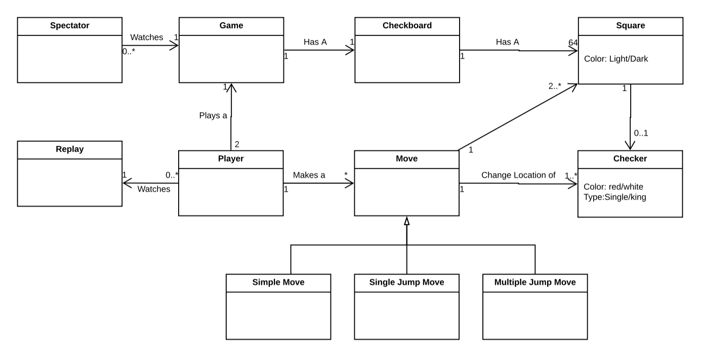
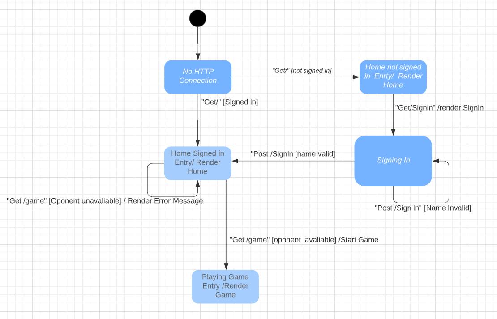
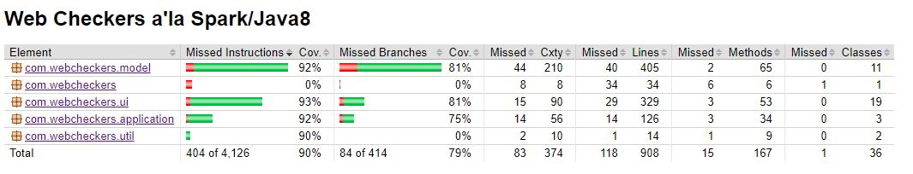
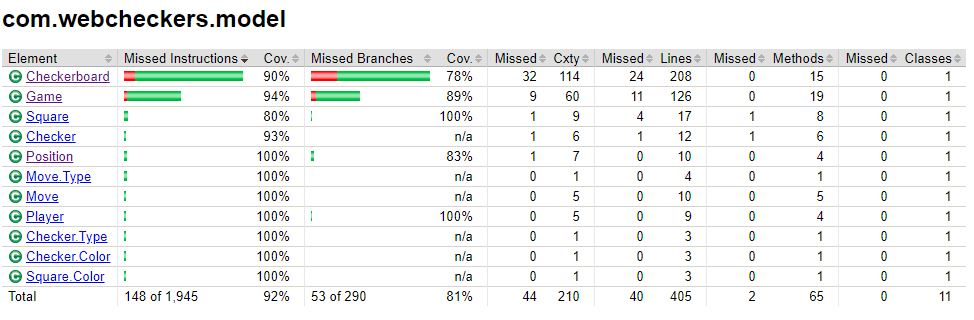
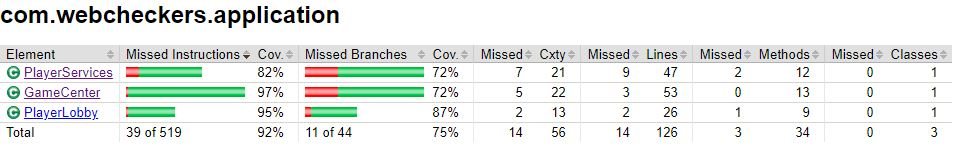
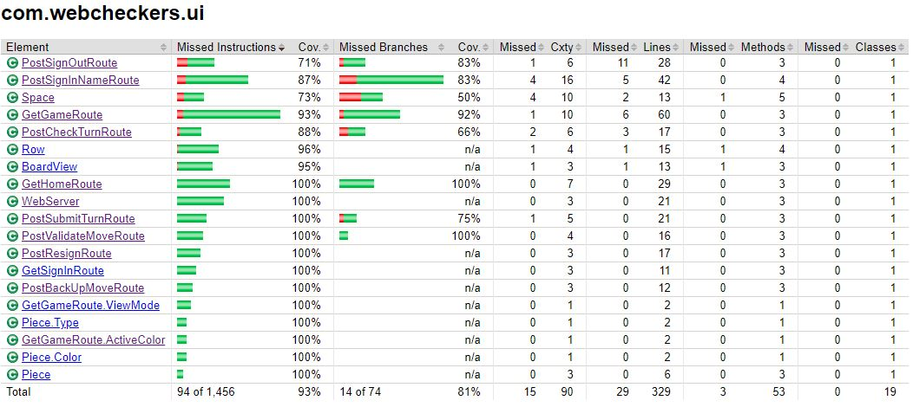

# WebCheckers Design Documentation

> _The following template provides the headings for your Design
> Documentation.  As you edit each section make sure you remove these
> commentary 'blockquotes'; the lines that start with a > character
> and appear in the generated PDF in italics._

## Team Information
* Team name: Insert Name Here (Team B)
* Team members
  * Sree Jupudy
  * Kesa Abbas
  * Jon Pofcher
  * Scott Court
  * Chris Tremblay

## Executive Summary

### Purpose
> Allow players to play checkers with other players that are 
> signed in. Allow them to play on a board where pieces can be 
> easily dragged and dropped.

### Glossary and Acronyms

| Term | Definition |
|------|------------|
| VO | Value Object |
|MVP|Minimum-Viable Product|
|UI|User Interface|
## Requirements
> As a player I want to be able to sign in and see other people I can play checkers against. 
> Once I have selected and opponent I want to be able to play a game of checkers by the American
> Standard Rules. I want to be able to make a move by dragging a piece when it is my turn. 
> I want to be able resign a game at any point and have it end, or end the game by winning or loosing.
> I want to be able to sign out at any point after signing in. 

### Definition of MVP
> Every player will be able to sign in and then play a game. 
> Two players must be able to play checkers by the American
> Standard Rules. Players must be able to choose to resign
> at any point which will end the game.

### MVP Features
> - As a player I want to make a move so that the game progresses.
> - As a player I want to end the game so that a winner is declared.
> - As a player I want to start a game so that I can play checkers with an opponent.
> - As a player I want to sign in so I can play a game of checkers.
> - As a player I want to sign out so I can stop checkers.

### Roadmap of Enhancements
> - Spectate, As a Player I want to spectate a game so that I can see the moves being made in real time.
> - Replay, As a player, I want to be able to replay the game so that I can see what moves I used in the previous game.

## Application Domain

This section describes the application domain.

> A Player plays of game checkers, where they can make a move. A move changes the space the checker is
> at on the checkerboard. The checkerboard holds and displays the state of the game. A player plays a
> game of checkers against another player with a variable amount of spectators watching the game. 
> A player can watch a replay of a game that has already been played.

## Architecture and Design

This section describes the application architecture.

### Summary

The following Tiers/Layers model shows a high-level view of the webapp's architecture.

As a web application, the user interacts with the system using a
browser.  The client-side of the UI is composed of HTML pages with
some minimal CSS for styling the page.  There is also some JavaScript
that has been provided to the team by the architect.

The server-side tiers include the UI Tier that is composed of UI Controllers and Views.
Controllers are built using the Spark framework and View are built using the FreeMarker framework.  The Application and Model tiers are built using plain-old Java objects (POJOs).

Details of the components within these tiers are supplied below.

### Overview of User Interface

This section describes the web interface flow; this is how the user views and interacts
with the WebCheckers application.

> When a player first connects to the WebCheckers site they will be met with home page 
> and an option to sign in. Clicking the sign in button will take them to the sign in page
> where they can enter a name, and sign in with it. If the name is not acceptable it will redirect them
> back to the sign in page. If the name is accepted it will send them back to the home page where they can 
> see other players that are signed in. Upon selecting another players name, it will send them to a game page
> where they can player their game of checkers.

### UI Tier
> The user can sign in with the parameters for the username as follows:
> - Must be equal to or more than 6 characters long
> - Cannot be than 25 characters long
> - It must contain at least 1 number
> - The first character cannot be a number
> - Cannot already be taken
> - Can contain spaces between words

> The UI Tier allows the player to sign-in, sign-out, make moves and sign out.
> GET Routes in the UI Tier handle the redirection to the appropriate route. 
> The routes and their specific functions:
>- GetGameRoute: It returns the current state of the game to the one of the players. 
>  It aides in the display of the correct orientation of the board for the player.
>- GetHomeRoute: It displays the messages to the user.
>- GetSignInRoute:It redirects user to the sign in page of the game.
>- PostBackUpMoveRoute: It asks the server to remove the last move made taht was validated.
>- PostCheckTurnRoute: After a valid move is done by the player, this route submits it to the server for validation.
>- PostResignRoute:It informs the server that the player is resigning the game, and when the action is successful,
>it redirects the user to homepage.
>- PostSignInNameRoute: It posts the sign in page for the player, and 
>- PostSignOutRoute: It post the dign out page to the player after the player signs out.
>- PostSubmitTurnRoute: Utilizing this action, it submits the user's turns.
>- PostValidateMoveRoute: It submits a single move made by the player to the server to check if that action is valid or not.

>The server responsible for handling the POST and GET routes is the Jetty WebServer in the WebServer Class.

### Application Tier

>The Application tier validates the player objects and manages the games and the players for the checker game.
>The Application tier is the main source of player and game creation logic.
>The functionality of Application tier includes:
>- It checks for the validity of the user name.
>- It keeps a list of users currently playing the game.  
>- It checks if the user name is on the list of the current players.
>- It adds the new player to the list of current players and 
>- It checks to see if a new player signed in and faciliates the converstaion between the tiers that a new player joined in.
>- It checks to see if the player is playing a game or not, it ends that session of game which has no players in it.
>- It also keeps track of the number of games that is being currently played, and tells the server to start
>a new game when the players are signed in and ready to play.

### Model Tier
> The Game classes offers a way for checking if a player has
> and legal turns by doing this process
> - Check if it is the red or white player we are checking
> - if white player: go through each piece and see if there is a valid move for it to make
> - if red player: flip board and do the same thing. algorithm only works one way

>
>The Model Tier is responsible for the domain enitites and the logic of the game. It communicates with the UI Tier 
>and check if the game rules are being correctly adhered. It has CheckerBoard, Checker, Game, Move, Player, Position 
>and Square classes.
>The CheckerBoard class creates a checkerboard for the players, and utilizes the checker and square to present a fully
>functional checker board. The move class is a place holder for the position and players of the Model Tier classes.
>The Checkerboard class contains the logic for the simple move, single jump, multiple jump moves and promotion to king.
>The game class starts the game for the player after the checkerboard is set, and when a move is made across the board,
>the move class checks for the validity of the move made by the user. If the move is right, depending on the
>type of move then the captured piece was removed from the checkerboard.
>The checkerboard class populates the board with the squares and checkers to present a fully functional checker board 
>for the players to play game. It decides the color of the square and the checker piece on the board. It also checks for
>the move made by the user and if it is valid or not. The class also takes in account if the all the pieces were captured
>or if there were any moves left on the board. It passes this information to the wrapper classes which would then 
>communicate it with the UI Tier classes and javascript for further implementation.
>
### Design Improvements
> The improvement would be to remove the duplicate classes from the UI Tier such as Row, Spaces, Pieces, and Boardview 
>since it violates the Object Oriented Design Principles. Since these classes have already been implemented
>in Model Tier classes. Most of the classes could be cleaned up and have small helper classes to have low coupling. 
>The checkerboard class has the most of the logic of the game. This class can be decomposed into smaller helper classes 
> such as single, single jump and multiple jump move classes. This would result in low coupling and high cohesion
>since the checker class would have only access to the object of the move classes. The design could be more efficient 
>if the king logic would be broken into smaller helper classes such as promotion to king. The smaller classes
>would allow easier debugging when a fault arises.
>

## Testing

### Acceptance Testing
> **13** Stories have passed acceptance testing. A lot of the issues we 
> found when test were signing in a out a lot could get annoying 
> and slow down testing. Potential changes for auto sign in 
> for testing might come. 
> - current issue of validating king moves properly

### Unit Testing and Code Coverage
> **90%** of our code is covered. Anywhere from 90%-95% will be 
> good for the team because there are lines of 
> code, classes, or functions that cannot be reached by unit testing
> or wouldn't benefit from testing. For example *WebServer* and 
> *Applicatiion*. Our strategy was to really hammer down on the model 
> and ui for testing since that's where a lot of the 
> where most of the logic is happening in the program.
>
> **Total Coverage**
> 
>
> **Model Coverage**
> 
>
>**Application Coverage**
>
>
> **UI Coverage**
> 